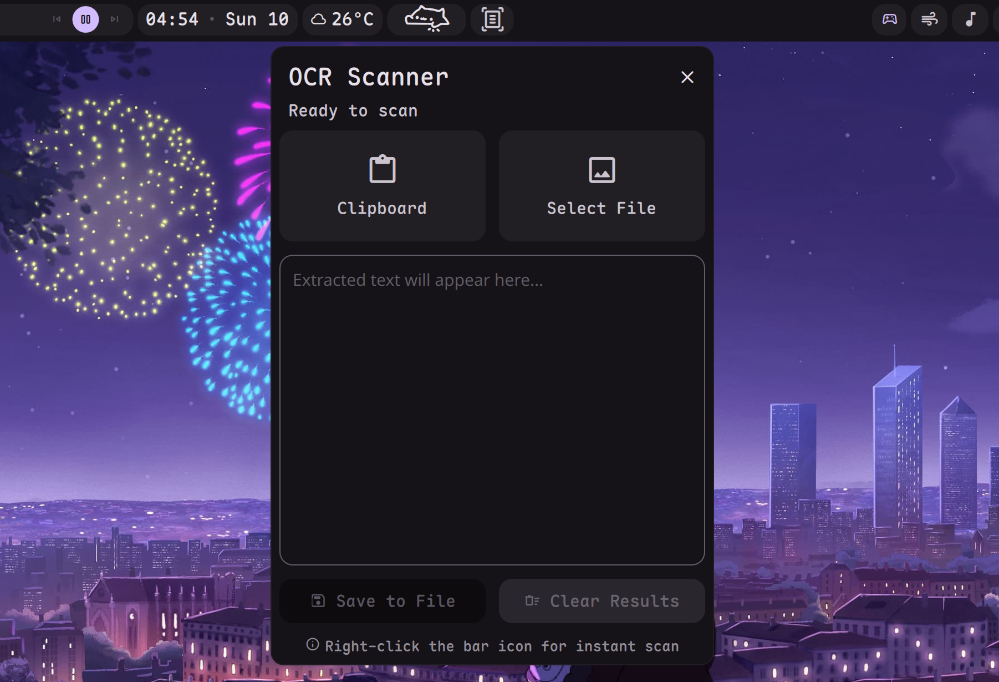

# OCR Scanner Plugin

A dedicated OCR (Optical Character Recognition) plugin for [Dank Material Shell](https://github.com/AvengeMedia/DankMaterialShell). Extract text from images in your clipboard or files instantly using the powerful Tesseract engine.



## Features

- **Native OCR**: Uses Tesseract for high-quality text recognition.
- **Drag & Drop Support**: Drag images or URLs directly onto the status bar icon to scan instantly.
- **Clipboard Integration**: Scan the latest image from your clipboard with a single click.
- **Native Experience**: Fully integrated with DMS theme and native dialogs.
- **Dynamic Language Discovery**: Automatically detects all Tesseract languages installed on your system.
- **Multi-language Support**: Select multiple languages simultaneously (e.g., English + Vietnamese) for mixed-content recognition.
- **Auto-copy**: Automatically copy the extracted text back to your clipboard after scanning.
- **Save to File**: Export the extracted text as a `.txt` file.
- **Editable Result**: Refine the extracted text directly in the popout before copying or saving.
- **Persistence Settings**: Choose whether to keep the results after closing the popout.

## Requirements

- `tesseract`: The OCR engine.
- `tesseract-data-<lang>`: Language data for Tesseract (e.g., `tesseract-data-eng`, `tesseract-data-vie`).
- `wl-clipboard`: For clipboard image handling (reading images from clipboard).
- `curl`: For remote image scanning.

### Installation (Fedora)

```bash
sudo dnf install tesseract tesseract-langpack-eng tesseract-langpack-vie wl-clipboard curl
```

### Installation (Arch Linux)

```bash
sudo pacman -S tesseract tesseract-data-eng tesseract-data-vie wl-clipboard curl
```

## Installation

1. Create a directory for the plugin:
   ```bash
   mkdir -p ~/.config/DankMaterialShell/plugins/ocrScanner
   ```
2. Copy all `.qml` and `plugin.json` files to that directory.
3. Reload DMS or scan for plugins in DMS Settings.

## License

GPL-3.0 - See [LICENSE](LICENSE)
